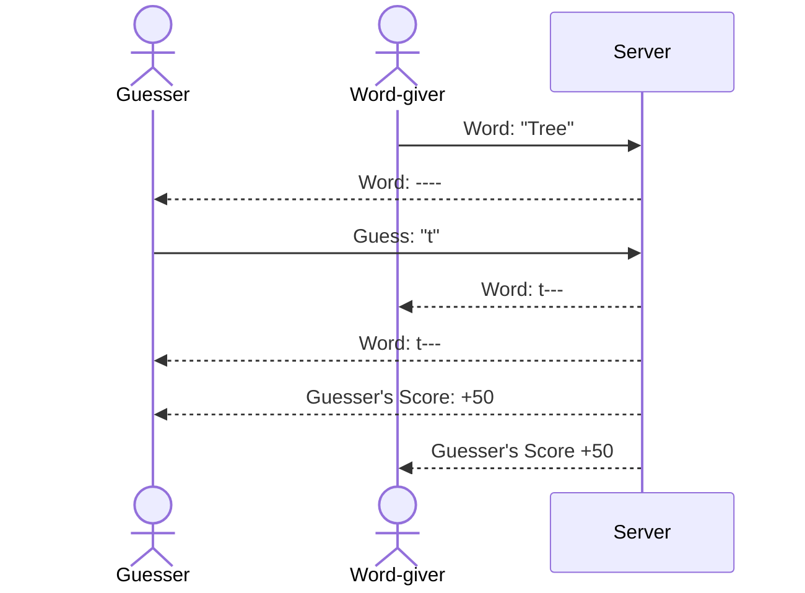

# Hangman

[My Notes](notes.md)

A multiplayer experience based on the classic game "hangman," where one player provides the word to be guessed and the other player guesses. Players are awarded points for their performance and must log in so that their points are saved.

> [!NOTE]
>  This is a template for your startup application. You must modify this `README.md` file for each phase of your development. You only need to fill in the section for each deliverable when that deliverable is submitted in Canvas. Without completing the section for a deliverable, the TA will not know what to look for when grading your submission. Feel free to add additional information to each deliverable description, but make sure you at least have the list of rubric items and a description of what you did for each item.

> [!NOTE]
>  If you are not familiar with Markdown then you should review the [documentation](https://docs.github.com/en/get-started/writing-on-github/getting-started-with-writing-and-formatting-on-github/basic-writing-and-formatting-syntax) before continuing.

## 🚀 Specification Deliverable

> [!NOTE]
>  Fill in this sections as the submission artifact for this deliverable. You can refer to this [example](https://github.com/webprogramming260/startup-example/blob/main/README.md) for inspiration.

For this deliverable I did the following. I checked the box `[x]` and added a description for things I completed.

- [x] Proper use of Markdown
- [x] A concise and compelling elevator pitch
- [x] Description of key features
- [x] Description of how you will use each technology
- [x] One or more rough sketches of your application. Images must be embedded in this file using Markdown image references.

### Elevator pitch

Have you ever wanted to play a game of hangman with a friend but found yourself lacking a piece of paper or a whiteboard on which to play? Has your game of hangman ever been interrupted, leaving you with a perpetual sense of dissatisfaction  at a game never completed? If either of these situations describes you, or if you just really like playing hangman, then we have the perfect website for you. My hangman website allows you to play the classic game in real-time with a friend! Unlike other hangman websites, where you play against a computer with a limited selection of words to guess, our website allows for infinite replayability, where you get both the satisfaction of giving great guesses as well as the jubilant glee of giving your friend a nearly impossible word to guess.  

### Design

Here is a sequence diagram that shows how the players would interact with the backend during the game.

### Key features

- The user can securely login
- The user can join a game with another user 
- The user can modify the game settings
- The user can play as either the guesser or the word-giver
- The user's points and name are displayed
- All the functionality of the hangman game

### Technologies

I am going to use the required technologies in the following ways.

- **HTML** - HTML will be used to structure both the login page and the game page.
- **CSS** - CSS will be used to style both pages, focusing on intuitive design over stylish graphics. The game itself will have very simple animations and transitions.
- **React** - Buttons and their associated logic for logging in. Text fields and their associated logic for providing a word and giving guesses. Handles updating what the viewer sees as the game progresses and more guesses are made.
- **Service** - Authentication and authorization, a dictionary to check words, retrieving and submitting guesses.
- **DB/Login** - Usernames and passwords will be stored. Along with high scores associated with those users.
- **WebSocket** - When two users join a game, both are notified. As one player guesses, the other player sees the guesses as well. Scores are updated for both players.

## 🚀 AWS deliverable

For this deliverable I did the following. I checked the box `[x]` and added a description for things I completed.

- [x] **Server deployed and accessible with custom domain name** - [My server link](https://yourdomainnamehere.click).

## 🚀 HTML deliverable

For this deliverable I did the following. I checked the box `[x]` and added a description for things I completed.

- [x] **HTML pages** - 4 HTML pages, 1 for each part of the game.
- [x] **Proper HTML element usage** - Used various HTML elements properly.
- [x] **Links** - All four pages can be navigated between from any one of them.
- [x] **Text** - Text for scores, settings, logging in, the game, etc.
- [x] **3rd party API placeholder** - I did complete this part of the deliverable.
- [x] **Images** - Added an image for the hanging man.
- [x] **Login placeholder** - Login on the login page.
- [x] **DB data placeholder** - Scores and login have a placeholder.
- [x] **WebSocket placeholder** - Connecting two users in a game has a placeholder.

## 🚀 CSS deliverable

For this deliverable I did the following. I checked the box `[x]` and added a description for things I completed.

- [x] **Header, footer, and main content body** - Consistent header and footer across the pages. Body is style in all the pages.
- [x] **Navigation elements** - Navigation is styled.
- [x] **Responsive to window resizing** - Most of the pages look decent and work when resized or zoomed. Doesn't hold up at the extremes.
- [x] **Application elements** - Elements are consitently styled and spaced.
- [x] **Application text content** - Used multiple fonts, font sizes, animations, and colors.
- [x] **Application images** - I did complete this part of the deliverable.

## 🚀 React part 1: Routing deliverable

For this deliverable I did the following. I checked the box `[x]` and added a description for things I completed.

- [x] **Bundled using Vite** - Wrapped it with Vite and got all the needed packages.
- [x] **Components** - Turned all the seperate HTMl pages into components.
- [x] **Router** - The website is a single page application that appears to have multiple pages now.

## 🚀 React part 2: Reactivity

For this deliverable I did the following. I checked the box `[x]` and added a description for things I completed.

- [x] **All functionality implemented or mocked out** - The game is fully playable. The user can easily navigate through all the pages and content. Content is updated, rendered, and reactive as would be expected.
- [x] **Hooks** - I used useEffect and useState multiple times for different things.

## 🚀 Service deliverable

For this deliverable I did the following. I checked the box `[x]` and added a description for things I completed.

- [x] **Node.js/Express HTTP service** - The website now has a backend using Node.js/Express.
- [x] **Static middleware for frontend** - Express is used to serve up the frontend.
- [x] **Calls to third party endpoints** - A third party dictionary API is called to verify the words submitted by the user.
- [x] **Backend service endpoints** - User data is stored on the backend and accessed with endpoints.
- [x] **Frontend calls service endpoints** - The frontend makes calls to the backend when validating users and uploading user data.

## 🚀 DB/Login deliverable

For this deliverable I did the following. I checked the box `[x]` and added a description for things I completed.

- [x] **User registration** - Users can sign up and their information is stored in MongoDB.
- [x] **User login and logout** - Familiar users are recognized and can login or logout at the scores page.
- [x] **Stores data in MongoDB** - User info and scores are stored in MongoDB.
- [x] **Stores credentials in MongoDB** - Hashed passwords and tokens are stored in MongoDB.
- [x] **Restricts functionality based on authentication** - Users cannot access anything but the login page until they are authenticated.

## 🚀 WebSocket deliverable

For this deliverable I did the following. I checked the box `[x]` and added a description for things I completed.

- [ ] **Backend listens for WebSocket connection** - I did not complete this part of the deliverable.
- [ ] **Frontend makes WebSocket connection** - I did not complete this part of the deliverable.
- [ ] **Data sent over WebSocket connection** - I did not complete this part of the deliverable.
- [ ] **WebSocket data displayed** - I did not complete this part of the deliverable.
- [ ] **Application is fully functional** - I did not complete this part of the deliverable.
